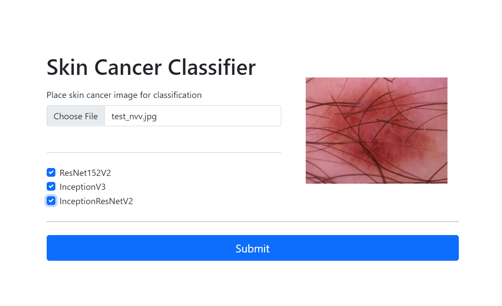
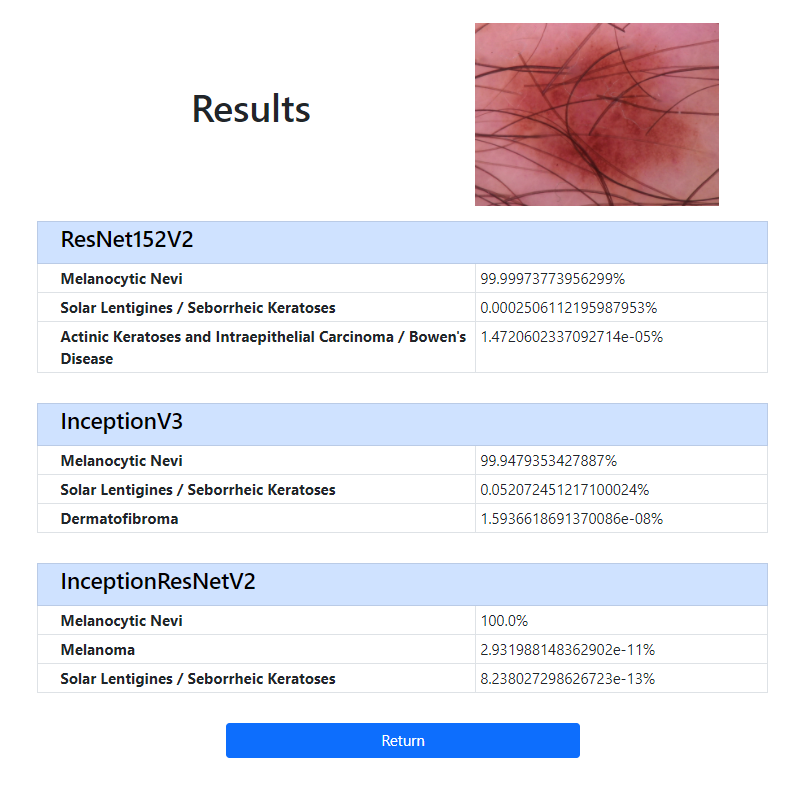

# Skin Cancer Classifier

The Skin Cancer Classifier project makes use of convolutional neural networks to process an image input and classifies it between 7 types of skin cancer: 

- actinic keratoses and intraepithelial carcinoma / Bowen's disease
- basal cell carcinoma
- benign keratosis-like lesions (solar lentigines / seborrheic keratoses and lichen-planus like keratoses)
- dermatofibroma
- melanoma
- melanocytic nevi
- vascular lesions (angiomas, angiokeratomas, pyogenic granulomas and hemorrhage)

The user may choose any of the 3 different CNN models to process the input. (Resnet152V2, InceptionV3, InceptionResnetV2)

<table><tr>
<td></td>
<td></td>
</tr></table>

Installation & Use
------------

This project runs on the Flask framework. It is recommended to run this project in a virtual environment. You can do this with the following instructions:

After forking, open CLI path to ```src/flask_app/```

#### Installing and Activating Virtual Environment (Recommended)

```
pip install virtualenv
```

For Mac/Linux users:
```
python3 -m venv env
.env/bin/activate
 ```


For Windows users: 
```
python -m venv env
env\Scripts\activate
 ```

#### Install Required Packages

```
pip install -r requirements.txt
```
#### Running the Project
Start the project by running:
```
flask run
```
If flask runs into errors, you may also run the 'app.py' file directly through python:  ```python app.py```

The project may take a few minutes to load (~1-5 minutes).
After successfully loading, it should read something like:
```
* Running on http://127.0.0.1:5000/ (Press CTRL+C to quit)
```
Simply copy and paste the URL into your browser.

Datasets
--------
The original dataset used for training the models can be found here: 
<br>https://www.kaggle.com/kmader/skin-cancer-mnist-ham10000

In order to balance out the amount of data for each class, as well as extending the training set, images were taken from the dataset and augmented. (Resized, rotated, zoomed, darkened/lightened, etc.) The code used for augmenting the data can be found in the folder 'datasets': ```src/datasets/```

Training Models
---------------
Each of the 3 CNN models (Resnet152V2, InceptionV3, InceptionResnetV2) were trained separately. The training code and logs can be found in the folder 'mlAlgorithms': ```src/mlAlgorithms/```

